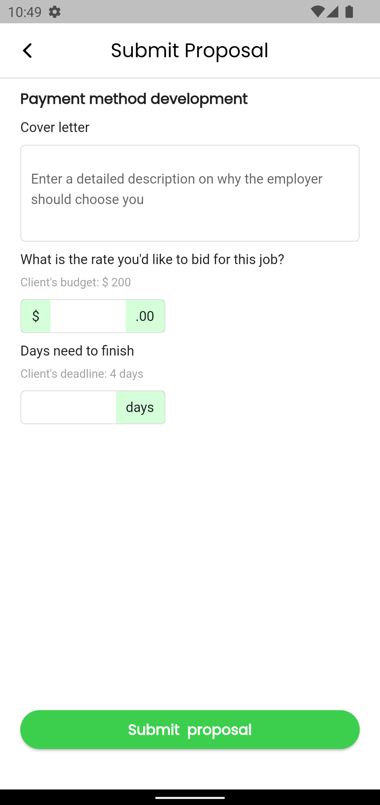

 # GETWORKER - ON GOING PROJECT

Getworker is a freelancer application with node js as the
backend, where the employee can search for freelance jobs
and submit a proposal. If the employer accepts the proposal,
an employee can work on that project within a certain time
period.
Following MVC architecture.

## Table of contenst

- [Installation](#installation)
- [Usage](#usage)
- [Screenshots](#screenshots)
- [Packages and Credits](#packages-and-credits)
- [License](#license)

## Installation

To install and run this project, you will need to have the following dependencies installed on
your machine:
 - Flutter SDK
 - Android Studio or Visual Studio Code
 - Node js

To install the project, follow these steps:

1. Clone the repository to your local machine
2. Open the project in Android Studio or Visual Studio Code
3. Connect an Android device or lauch an emulator
4. Run the command 'flutter pub get' using the terminal
5. Run the project by clicking the "run" button in the top menu or by using the terminal
   command 'flutter run'
6. Run the command 'npm start' in the cmd of the backend folder   

## Usage 

User can do  the following:

- Can seek job
- Submit a proposal
- If the employer accepts the bid user can work as a employee for that project
- Need to purchase credits for submitting a proposal
- Can verify KYC
- Get paid by the employer 
- Chat with employee (on the process)

## Screenshots 

Login Screen                    |   Job Screen             |  Job Detail Screen    |  Submit Proposal Screen
:-------------------------:|:-------------------------:|:-------------------------:|:-------------------------:
|||

## Packages and Credits

- [GetX](https://github.com/jonataslaw/getx)
- [Http](https://github.com/dart-lang/http/tree/master/pkgs/http)
- [Flutter secure storage](https://github.com/mogol/flutter_secure_storage/tree/develop/flutter_secure_storage)
- [Flutter spin kit](https://github.com/jogboms/flutter_spinkit)
- [Shimmer](https://github.com/hnvn/flutter_shimmer)

## License

- MIT License
- Copyright 2022 © [ASWINSUBHASH](https://github.com/aswinsubhash)

